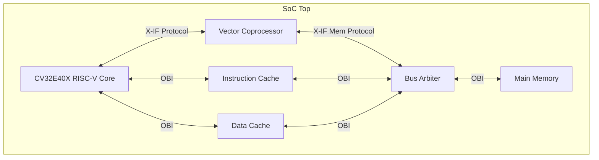
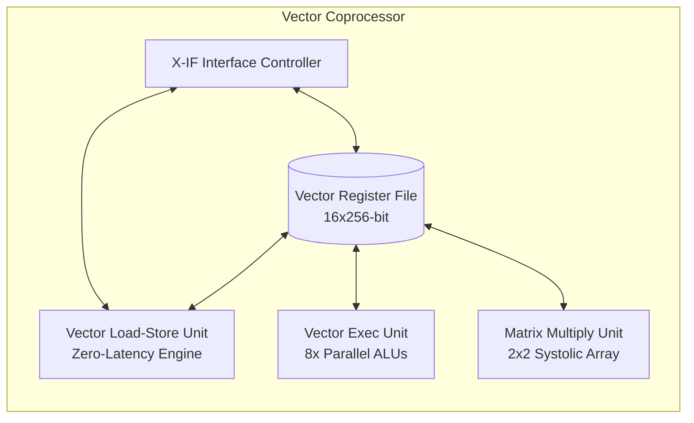
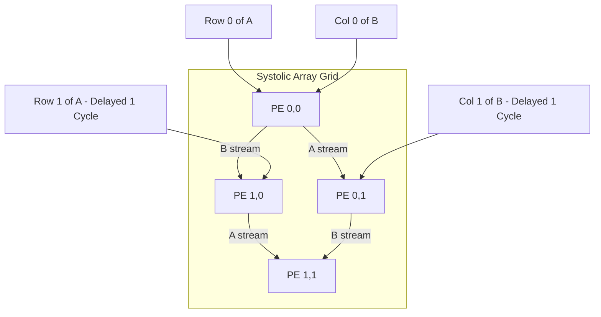

# RISC-V Vector Coprocessor (VCoP) Architecture Specification

This document provides a detailed overview of the Vector Coprocessor (VCoP) architecture, its custom Instruction Set Architecture (ISA), microarchitectural blocks, system integration with the OpenHW Group **CV32E40X RISC-V CPU core**, and programming guidelines.

---

## 1. System Overview

The Vector Coprocessor (VCoP) is a high-performance, area-efficient hardware accelerator designed to perform element-wise vector operations and tile-based matrix multiplication. It integrates as a coprocessor with the **CV32E40X RISC-V CPU core** via the standard **eXtension Interface (X-IF)**.



### Key Technical Specs
* **Vector Length (VLEN)**: 256 bits
* **Element Width**: 32 bits (fixed-point / integer)
* **Elements per Vector**: 8 parallel elements ($256 \text{ bits} / 32 \text{ bits}$)
* **Vector Register File (VRF)**: 16 registers (`v0` to `v15`), 3 Read Ports / 1 Write Port
* **Arithmetic Latency**: Single-cycle for parallel element-wise vector operations
* **Matrix Acceleration**: HW-managed 2×2 Systolic Array with hardware tiling up to 8×8 matrices
* **Cache System**: Direct-mapped 2KB Instruction Cache & 2KB Data Cache with Open Bus Interface (OBI) compliance

---

## 2. Instruction Set Architecture (ISA)

VCoP registers its instructions in the RISC-V **Custom-0 (0x0B)** opcode space. It implements a standard R-type instruction layout to support vector-vector and vector-scalar memory operations.

### Instruction Format (R-Type)

| 31 ... 25 | 24 ... 20 | 19 ... 15 | 14 ... 12 | 11 ... 7 | 6 ... 0 |
| :---: | :---: | :---: | :---: | :---: | :---: |
| **funct7** | **rs2** | **rs1** | **funct3** | **rd** | **opcode** |
| Opcode Ext | Vector Src 2 | Vector Src 1 / Scalar Base | Matrix Size / Stride | Vector Dest / Address Offset | `0001011` (0x0B) |

### Instruction Set Summary

| Instruction | funct7 (Bin) | funct7 (Hex) | funct3 | Description | Math Operation / Behavior |
| :--- | :---: | :---: | :---: | :--- | :--- |
| **VLD** | `0000001` | `0x01` | `000` | Vector Load | `vrf[rd] = Mem[rs1] ... Mem[rs1 + 28]` (8 words) |
| **VST** | `0000010` | `0x02` | `000` | Vector Store | `Mem[rs1] ... Mem[rs1 + 28] = vrf[rs2]` (8 words) |
| **VMAC** | `0000011` | `0x03` | `000` | Vector Multiply-Accumulate | `vrf[rd] = (vrf[rs1] * vrf[rs2]) + vrf[rd]` (Element-wise) |
| **VADD** | `0000100` | `0x04` | `000` | Vector Add | `vrf[rd] = vrf[rs1] + vrf[rs2]` (Element-wise) |
| **VSUB** | `0000101` | `0x05` | `000` | Vector Subtract | `vrf[rd] = vrf[rs1] - vrf[rs2]` (Element-wise) |
| **VMUL** | `0000110` | `0x06` | `000` | Vector Multiply | `vrf[rd] = vrf[rs1] * vrf[rs2]` (Element-wise) |
| **VDOT** | `0000111` | `0x07` | `000` | Vector Dot Product | `scalar_rd = sum(vrf[rs1] * vrf[rs2])` (Optional/Scalar writeback) |
| **VMMUL** | `0001000` | `0x08` | `size` | Vector Matrix Multiply | $C = A \times B$ (Supports tiles: `000`=2×2, `001`=4×4, `010`=8×8) |

> [!NOTE]
> For **VMMUL**, the `funct3` field defines the matrix dimensions:
> * `3'b000`: 2×2 Matrix multiplication (Fits within a single 256-bit vector register per matrix)
> * `3'b001`: 4×4 Matrix multiplication
> * `3'b010`: 8×8 Matrix multiplication (Matrices span across multiple registers row-by-row: `v0-v7` for matrix A, `v8-v15` for matrix B)

---

## 3. Microarchitecture

The coprocessor consists of four primary internal components: the Vector Register File (VRF), the Vector Execution Unit (VEU), the Vector Load/Store Unit (VLSU), and the Matrix Multiplication Unit.



### 3.1 Vector Register File (VRF)
The VRF contains 16 vector registers (`v0` to `v15`), each 256 bits wide.
* **3 Read Ports / 1 Write Port Design**: Designed specifically to support single-cycle **VMAC** execution. Port 1 reads `rs1`, Port 2 reads `rs2`, and Port 3 reads the accumulator `rd`.
* **3-Port Addressing**:
  ```systemverilog
  // Read operand paths
  assign vrf_rdata1 = register_array[rs1_addr];
  assign vrf_rdata2 = register_array[rs2_addr];
  assign vrf_rdata3 = register_array[rd_addr]; // Read accumulator
  
  // Write result path
  always_ff @(posedge clk_i) begin
      if (we_i) register_array[waddr_i] <= wdata_i;
  end
  ```

### 3.2 Vector Execution Unit (VEU)
The VEU executes element-wise vector operations.
* **SIMD Architecture**: Contains 8 identical 32-bit hardware functional units.
* **Single-Cycle Completion**: Arithmetic instructions (`VADD`, `VSUB`, `VMUL`, `VMAC`) are designed as combinational blocks that complete in a single clock cycle, updating the VRF immediately on the next rising edge.
* **VMAC Datapath**:
  $$\text{Result}[i] = (\text{OperandA}[i] \times \text{OperandB}[i]) + \text{OperandC}[i]$$
  Implemented using a multiplier-accumulator chain per element:
  ```systemverilog
  prod = a_elem * b_elem;
  sum = prod + c_elem;
  vmac_result[i*32 +: 32] = sum[31:0];
  ```

### 3.3 Vector Load/Store Unit (VLSU)
The VLSU transfers 256-bit vectors to and from a 32-bit memory bus interface.
* **Serialization**: Automatically breaks down a 256-bit vector request into 8 sequential 32-bit OBI memory request transactions.
* **Zero-Latency Memory Start**: The VLSU optimizes performance by starting the first memory transaction (asserting `xif_mem_valid_o` and driving the base address from `rs1`) on the **same clock cycle** the instruction is accepted.
* **Zero-Latency Read Pipelines**: Integrates with a combinational read-response memory scheme. As memory replies in the same cycle as the request, the load latency is minimized to just $\sim 4$ to $8$ cycles (depending on bus grants).

### 3.4 Matrix Multiplication Unit (Systolic Array)
VCoP includes a dedicated hardware matrix multiplier utilizing a 2×2 Systolic Array architecture.



* **Processing Element (PE)**: Each PE in the 2×2 grid contains an $A$-register, $B$-register, a $32 \times 32$-bit multiplier, and a 64-bit accumulator register to prevent overflow during matrix dot-products.
* **Input Skewing**: For proper systolic wavefront operation, row 1 of Matrix A and column 1 of Matrix B are skewed (delayed by 1 cycle using registers) before entering the grid.
* **Hardware Tiling Controller**: Automatically manages multiplication of larger matrices (4×4 and 8×8). The controller partitions large matrices into 2×2 tiles, feeds the systolic array, schedules accumulation cycles, and writes the final rows back to the VRF in row-major layout.

---

## 4. System Integration & Memory Hierarchy

### eXtension Interface (X-IF)
The CV32E40X core issues instructions to the VCoP using the OpenHW eXtension Interface.
1. **Issue Phase**: CPU issues instruction. VCoP checks if opcode is `CUSTOM-0` (0x0B) and state is `IDLE`. If so, it asserts `accept`.
2. **Memory Phase**: For loads/stores, VCoP acts as an initiator, requesting memory access via the CPU's memory ports.
3. **Writeback Phase**: Once complete, VCoP responds on the result interface, returning the instruction ID, destination register, and a scalar writeback signal if necessary.

### Cache Subsystem
VCoP relies on a direct-mapped cache architecture to prevent memory bottlenecking during vector loading:
* **Instruction Cache (ICache)**: 2KB size, 16-byte line size (4 words), read-only.
* **Data Cache (DCache)**: 2KB size, 16-byte line size, write-through policy.
* **Arbiter**: A fixed-priority arbiter routes memory requests.
  $$\text{Priority: ICache} > \text{DCache} > \text{Vector Coprocessor (VPU)}$$

---

## 5. Software Programming Guide

To compile code for VCoP, programmers use inline assembly or `.word` directives since standard toolchains do not natively assemble custom vector instructions.

### C Inline Macros
The following C macros are used to execute vector operations:

```c
#define OPCODE_CUSTOM0  0x0B
#define FUNCT7_VLD      0x01
#define FUNCT7_VST      0x02
#define FUNCT7_VMAC     0x03
#define FUNCT7_VADD     0x04
#define FUNCT7_VSUB     0x05
#define FUNCT7_VMUL     0x06
#define FUNCT7_VMMUL    0x08

// Vector load: vd = Mem[addr]
static inline void vector_load(int vd, volatile void* addr) {
    asm volatile(
        "mv a0, %1\n\t"
        ".word ((%2 << 25) | (0 << 20) | (10 << 15) | (0 << 12) | (%0 << 7) | %3)"
        :: "i"(vd), "r"(addr), "i"(FUNCT7_VLD), "i"(OPCODE_CUSTOM0)
        : "a0", "memory"
    );
}

// Vector store: Mem[addr] = vs
static inline void vector_store(int vs, volatile void* addr) {
    asm volatile(
        "mv a0, %1\n\t"
        ".word ((%2 << 25) | (%0 << 20) | (10 << 15) | (0 << 12) | (0 << 7) | %3)"
        :: "i"(vs), "r"(addr), "i"(FUNCT7_VST), "i"(OPCODE_CUSTOM0)
        : "a0", "memory"
    );
}

// Vector element-wise add: vd = vs1 + vs2
static inline void vector_add(int vd, int vs1, int vs2) {
    asm volatile(
        ".word ((%3 << 25) | (%2 << 20) | (%1 << 15) | (0 << 12) | (%0 << 7) | %4)"
        :: "i"(vd), "i"(vs1), "i"(vs2), "i"(FUNCT7_VADD), "i"(OPCODE_CUSTOM0)
        : "memory"
    );
}

// Vector element-wise MAC: vd = vs1 * vs2 + vd
static inline void vector_mac(int vd, int vs1, int vs2) {
    asm volatile(
        ".word ((%3 << 25) | (%2 << 20) | (%1 << 15) | (0 << 12) | (%0 << 7) | %4)"
        :: "i"(vd), "i"(vs1), "i"(vs2), "i"(FUNCT7_VMAC), "i"(OPCODE_CUSTOM0)
        : "memory"
    );
}
```

### Compilation Command
Compile code using the standard RISC-V GNU toolchain targeting the standard `rv32im` architecture:
```bash
riscv64-unknown-elf-gcc -march=rv32im -mabi=ilp32 -nostartfiles -nostdlib -Tlink.ld startup.s main.c -o program.elf
```

---

## 6. Synthesis and Gate Count Estimates

Synthesis results using Yosys against standard cells show that the Vector Coprocessor introduces a major performance benefit at an extremely low silicon cost:

* **CV32E40X Core Footprint**: ~15,433 lines of SystemVerilog code, estimated **3,669 logic gates**.
* **Vector Coprocessor Footprint**: ~571 lines of SystemVerilog code, estimated **167.6 logic gates**.
* **Gate Overhead**: Adding VCoP adds only **~4.5% gate overhead** to the CPU core while enabling up to $8\times$ arithmetic speedups.
