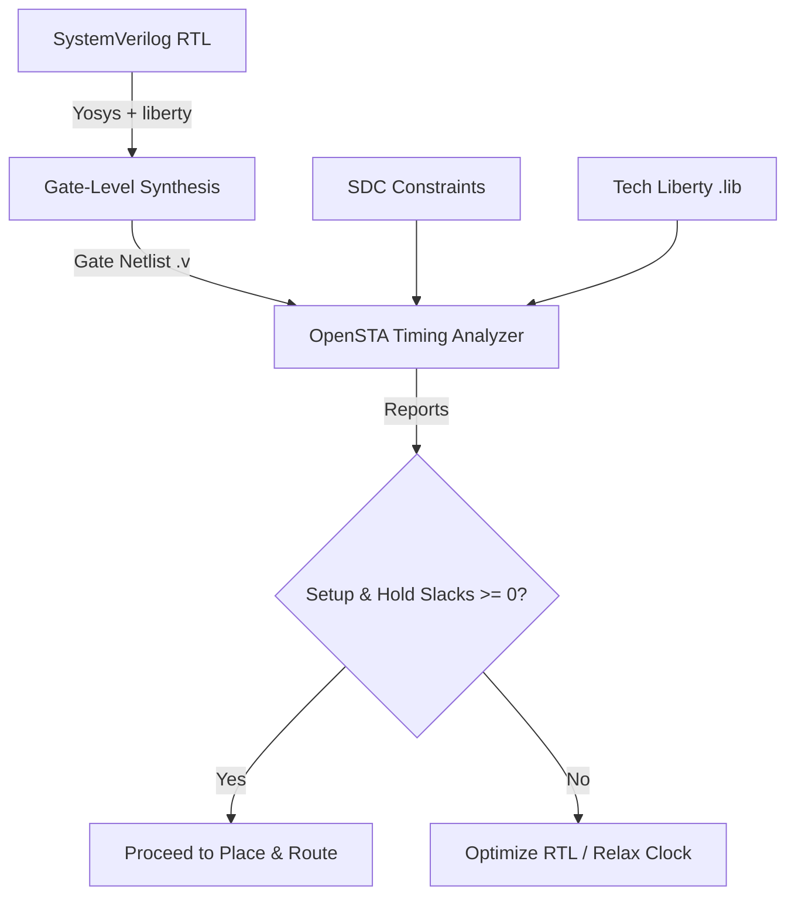

# Static Timing Analysis (STA) Guide for Vector Coprocessor

This guide outlines how to perform Static Timing Analysis (STA) on the Vector Coprocessor (VCoP) design to verify timing closure (setup and hold times) targeting the **SkyWater 130nm (sky130_fd_sc_hd)** technology node.

---

## 1. Overview of the STA Flow

To check if the hardware design runs correctly at your target clock frequency (e.g., 50 MHz) under physical conditions, we perform a standard three-step timing flow:



1. **Synthesis (Yosys)**: Compiles high-level RTL registers and ALUs into specific gate standard cells (like `sky130_fd_sc_hd__nand2_1`, `sky130_fd_sc_hd__dfxtp_1`) and outputs a mapped gate netlist.
2. **Timing Constraints (SDC)**: Specifies constraints like the clock frequency, clock uncertainty, output capacitance load, and peripheral pin delays.
3. **Timing Verification (OpenSTA)**: Traverses each register-to-register gate path, calculating gate/wire propagation delays, and checks for **Setup** (maximum delay) and **Hold** (minimum delay) timing violations.

---

## 2. Timing Scripts in Your Repository

We have added three template configuration files in your [yosys/](file:///Users/vs/function/coprocessor/yosys) folder to automate this process:

1. **[synth_sky130.ys](file:///Users/vs/function/coprocessor/yosys/synth_sky130.ys)**: Yosys script mapping SystemVerilog designs to SkyWater 130nm cells.
2. **[coprocessor.sdc](file:///Users/vs/function/coprocessor/yosys/coprocessor.sdc)**: Synopsys Design Constraints file modeling clock constraints and IO margins.
3. **[run_sta.tcl](file:///Users/vs/function/coprocessor/yosys/run_sta.tcl)**: TCL script that runs OpenSTA to parse delays and print critical paths.

---

## 3. Step-by-Step Execution

### Step 1: Set up PDK Variables
Ensure your `PDK_ROOT` environment variable is exported to point to your local SkyWater PDK install folder containing the cell library files:

```bash
export PDK_ROOT=/home/user/openlane/pdks # Or your specific path
```

If your liberty file is located at a different path, edit line 24 of [synth_sky130.ys](file:///Users/vs/function/coprocessor/yosys/synth_sky130.ys) and line 4 of [run_sta.tcl](file:///Users/vs/function/coprocessor/yosys/run_sta.tcl) to point directly to your `.lib` file.

### Step 2: Run Gate-Level Synthesis
Run Yosys to generate the gate-level netlist:

```bash
yosys -s yosys/synth_sky130.ys
```

* **Output File**: [yosys/vector_coprocessor.synth.v](file:///Users/vs/function/coprocessor/yosys/vector_coprocessor.synth.v) (the mapped structural gate netlist).

### Step 3: Run Static Timing Analysis
Run OpenSTA (`sta`) to compute cell delays and find timing violations:

```bash
sta yosys/run_sta.tcl | tee yosys/sta_report.log
```

---

## 4. Understanding STA Output Reports

OpenSTA generates timing reports indicating the critical paths. Key parameters to monitor:

### Setup Analysis (Max Delay)
Checks if the data propagates from Register A to Register B fast enough before the next clock edge arrives:

$$\text{Data Arrival Time} < \text{Clock Period} - \text{Setup Time Requirement} - \text{Uncertainty}$$

* **Slack**: If slack is **positive ($\ge 0$)**, setup timing passes. If **negative ($< 0$)**, you have a setup violation.
* **Fixing Setup Violations**: Increase the clock period (reduce frequency), optimize the critical combinational logic path in RTL, or select faster cell drive strengths in P&R.

### Hold Analysis (Min Delay)
Checks if the data stays stable at the input of Register B long enough after the clock edge to prevent latching incorrect data:

$$\text{Data Propagation Delay} > \text{Hold Time Requirement}$$

* **Slack**: If slack is **positive ($\ge 0$)**, hold timing passes. If **negative ($< 0$)**, you have a hold violation.
* **Fixing Hold Violations**: Hold violations are independent of clock period. They are fixed during Place & Route by inserting delay buffers on fast data paths.
